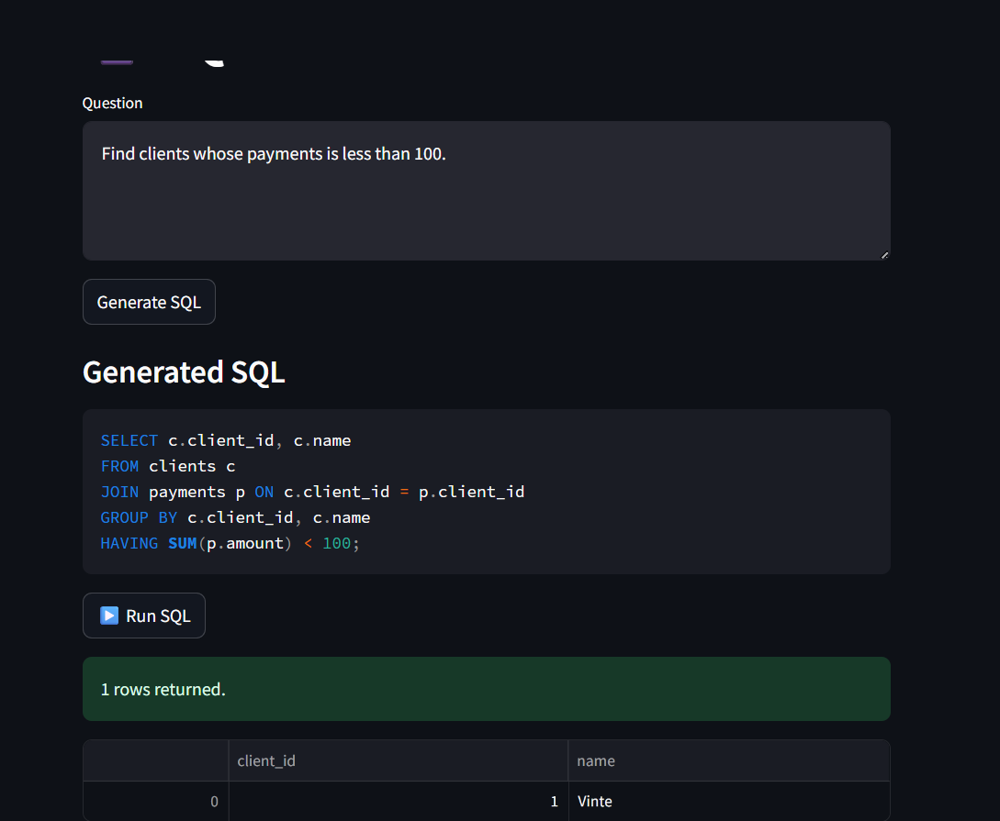

# 🚀 SQL RAG Assistant

A Retrieval-Augmented Generation (RAG) application that converts natural language questions into executable SQL queries using LlamaIndex, OpenRouter LLMs, ChromaDB, MySQL, and Streamlit.

The application retrieves relevant database schema documents from a vector database before generating SQL, reducing hallucinations and improving query accuracy.

---

## Features

- Natural Language → SQL generation
- Retrieval-Augmented Generation (RAG)
- Document ingestion pipeline with LlamaIndex
- AI-generated metadata (titles and representative questions)
- ChromaDB vector storage
- HuggingFace embeddings
- Streamlit web interface
- MySQL execution engine
- Docker & Docker Compose support

---

## Tech Stack

- Python
- LlamaIndex
- Streamlit
- ChromaDB
- HuggingFace Embeddings
- OpenRouter LLM
- MySQL
- Docker
- Docker Compose

---

## Architecture

```
User Question
      │
      ▼
 Streamlit UI
      │
      ▼
LlamaIndex Query Engine
      │
      ▼
Retrieve Relevant Schema
      │
      ▼
OpenRouter LLM
      │
      ▼
Generate SQL
      │
      ▼
Execute SQL on MySQL
      │
      ▼
Display Results
```

---

## Project Structure

```
.
├── streamlit-app/
│   ├── app.py
│   ├── chat.py
│   └── Dockerfile
│
├── init.sql
├── docker-compose.yml
├── requirements.txt
├── Copy_of_llamaindex_vector_stores.ipynb
└── README.md
```

---

## Document Ingestion Pipeline

The ingestion pipeline enriches the database schema before indexing.

- Sentence splitting
- Title generation using an LLM
- Question generation for each chunk
- Metadata enrichment
- Vector embedding generation

These enriched nodes are stored inside ChromaDB and used during retrieval.

---

## Running the Project

### Clone

```bash
git clone https://github.com/Abdollahshomakhar/text_to_sql_2.git
cd text_to_sql_2
```


### Run

```bash
docker compose up --build
```

---

## Example

Input

```
Find clients whose payments are less than 100.
```

Generated SQL

```sql
SELECT c. client_id, c. name
FROM clients c
JOIN payments p ON c. client_id = p. client_id
GROUP BY c. client_id, c. name HAVING SUM (p. amount) < 100;
```

---

## Screenshots

### Application



---

## Future Improvements

- SQL validation

## License

MIT
